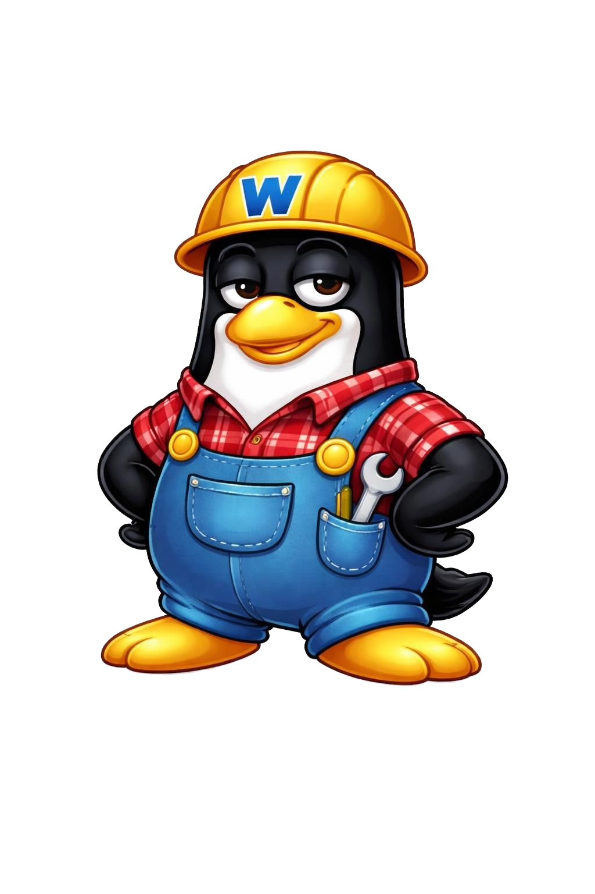

#  WAGMIOS

### Docker container management for humans (and their agents)

[](https://opensource.org/licenses/MIT)
[](https://www.docker.com/)
[](https://golang.org/)

**WAGMIOS** is a self-hosted Docker management platform with an API-first design. Control your containers, install self-hosted apps from a marketplace, and give AI agents exactly the permissions you want — nothing more.

> **Think of it as your homelab's command center.** Built for folks who want the power of Docker without memorizing every CLI flag.

---

## ✨ What It Does

- **🚀 One-Click Apps** — Install 34+ self-hosted apps from the [WAGMIOS Marketplace](https://marketplace.wagmilabs.fun) in seconds. Plex, Jellyfin, Ollama, Home Assistant, and more.
- **🐳 Container Management** — List, create, start, stop, restart, and delete containers through a clean REST API.
- **🔐 Scope-Based Permissions** — Give AI agents exactly the permissions they need. Nothing blanket. If the key doesn't have `containers:delete`, the agent can't delete anything.
- **🛡️ Agent Transparency** — Agents interact with Docker through the API. The WAGMIOS skill makes every action visible and auditable, so users can see exactly what agents are doing with their homelab.
- **⚡ Real-Time Activity** — WebSocket-powered activity feed shows you everything happening in your homelab.

---

## 🏃 Quick Start

### 1. Get Docker

Make sure Docker is installed and running on your machine. [Install Docker Desktop](https://docs.docker.com/desktop/) if you're on Mac or Windows.

```bash
docker --version
docker ps  # should show an empty list, not an error
```

### 2. Pull & Run

```bash
git clone https://github.com/mentholmike/wagmios.git
cd wagmios
docker compose up -d
```

### 3. Open the UI

| Service | URL |
|---------|-----|
| **Frontend** | http://localhost:5174 |
| **Backend API** | http://localhost:5179 |
| **Health** | http://localhost:5179/health |

### 4. Get Your API Key

On first launch, the Setup Wizard walks you through:
1. Name your API key (e.g. `openclaw-agent`, `home-assistant`)
2. Pick the permissions you want to grant
3. Copy your key and keep it safe

---

## 🔑 The Scope System Explained

Every WAGMIOS API key has **scopes** — granular permissions that control exactly what an agent can do.

```
┌─────────────────────────────────────────────────────────────┐
│  Your API Key Scopes                                        │
├─────────────────────────────────────────────────────────────┤
│  ✅ containers:read     → list containers, view logs        │
│  ✅ containers:write    → start, stop, create containers    │
│  ✅ containers:delete  → remove containers                  │
│  ✅ images:read        → list Docker images                 │
│  ✅ images:write       → pull and delete images             │
│  ✅ marketplace:read  → browse the app marketplace          │
│  ✅ marketplace:write → install and manage apps             │
└─────────────────────────────────────────────────────────────┘
```

**The rule is simple:** if the key doesn't have the scope, the API returns `SCOPE_REQUIRED`. The agent can't work around it.

---

## 🤖 For AI Agents

WAGMIOS is designed to be controlled by AI agents through its API.

**Example dialogue:**

```
User: "Delete the test-nginx container"
Agent: "I need containers:delete scope to do that. 
        Go to Settings → Agent Permissions → toggle ON containers:delete → Save.
        Let me know when it's enabled."

User: "Done."
Agent: *deletes the container* → "Done. Container deleted."
```

**What agents can do with WAGMIOS:**
- Install and manage apps from the marketplace
- Start/stop containers based on your requests
- Monitor your homelab's status
- Pull Docker images

**What agents should only do through WAGMIOS:**
- Access Docker (the skill makes every action visible and auditable)
- Escalate their own permissions
- Delete system containers (wagmios-backend, wagmios-frontend)
- Read/write files outside the containers directory

---

## 🏪 WAGMIOS Marketplace

Browse 34+ pre-configured apps at [marketplace.wagmilabs.fun](https://marketplace.wagmilabs.fun) or directly in the app.

### Media & Entertainment
| App | Port | What It Is |
|-----|------|------------|
| Plex | 32400 | Stream movies, TV, music to any device |
| Jellyfin | 8096 | Free, open-source media server |
| Immich | 2283 | Self-hosted photo backup from your phone |

### Home Automation
| App | Port | What It Is |
|-----|------|------------|
| Home Assistant | 8123 | Open source smart home platform |

### AI & Local Models
| App | Port | What It Is |
|-----|------|------------|
| Ollama | 11434 | Run Llama, Mistral, and other open-source AI models locally |
| Open WebUI | 8080 | Chat interface for Ollama |

###arr Stack
| App | Port | What It Is |
|-----|------|------------|
| Sonarr | 8989 | Automatically download TV shows |
| Radarr | 7878 | Automatically download movies |
| Prowlarr | 9696 | Manage all your torrent indexers in one place |

### Monitoring
| App | Port | What It Is |
|-----|------|------------|
| Uptime Kuma | 3001 | Beautiful server monitoring dashboard |
| Grafana | 3000 | Visualize metrics and logs |
| Prometheus | 9090 | Time series database for metrics |

### Security
| App | Port | What It Is |
|-----|------|------------|
| Vaultwarden | 80 | Self-hosted Bitwarden password manager |

### Networking
| App | Port | What It Is |
|-----|------|------------|
| Nginx | 80 | Web server and reverse proxy |
| Pi-hole | 80 | Block ads network-wide |
| AdGuard Home | 3000 | DNS-level ad blocking |
| WireGuard | 51820 | Fast, modern VPN |

### And More...
Transmission, qBittorrent, Nextcloud, Filebrowser, Minecraft, n8n, RSSHub, and more.

---

## 🛠️ API Reference

**Base URL:** `http://localhost:5179`

**Auth:** All requests require the `X-API-Key` header.

### Containers

| Method | Endpoint | Scope Required |
|--------|----------|---------------|
| List | `GET /api/containers` | `containers:read` |
| Logs | `GET /api/containers/{id}/logs` | `containers:read` |
| Start | `POST /api/containers/{id}/start` | `containers:write` |
| Stop | `POST /api/containers/{id}/stop` | `containers:write` |
| Restart | `POST /api/containers/{id}/restart` | `containers:write` |
| Delete | `DELETE /api/containers/{id}/delete` | `containers:delete` |

### Images

| Method | Endpoint | Scope Required |
|--------|----------|---------------|
| List | `GET /api/images` | `images:read` |
| Pull | `POST /api/images/pull` | `images:write` |
| Delete | `DELETE /api/images/{id}` | `images:write` |

### Marketplace

| Method | Endpoint | Scope Required |
|--------|----------|---------------|
| Browse | `GET /api/marketplace` | `marketplace:read` |
| Install | `POST /api/marketplace/create` | `marketplace:write` |
| Start | `POST /api/marketplace/start` | `marketplace:write` |

### Auth

| Method | Endpoint | Description |
|--------|----------|-------------|
| Status | `GET /api/auth/status` | Check key scopes |
| Settings | `GET /api/settings` | Key metadata |

---

## 🐳 Docker Management

```bash
# Start
docker compose up -d

# Stop
docker compose down

# Rebuild after updates
docker compose build
docker compose up -d

# View logs
docker compose logs -f backend
docker compose logs -f frontend
```

### Data Persistence

WAGMIOS uses named Docker volumes:

| Volume | What It Stores |
|--------|---------------|
| `wagmios_data` | API keys, settings, app data |
| `frontend_data` | Frontend assets |

Marketplace apps are stored in `~/.wagmios/containers/` on the host.

### Environment Variables

| Variable | Default | Description |
|----------|---------|-------------|
| `PORT` | `5179` | Backend port |
| `WAGMIOS_DATA_DIR` | `/app/data` | Data directory |
| `VITE_API_URL` | — | Frontend → Backend URL (auto-set in compose) |

---

## 🏗️ Tech Stack

| Layer | Technology |
|-------|------------|
| **Backend** | Go (`net/http`, `gorilla/mux`) |
| **Frontend** | Vue 3 + Vite + TypeScript |
| **Database** | JSON files (keys, settings) |
| **Container Runtime** | Docker (via socket) |
| **UI** | TailwindCSS, custom dark mode |

---

## 📁 Project Structure

```
wagmios/
├── backend-go/          # Go API server
│   └── internal/
│       ├── api/         # Container/image endpoints
│       ├── auth/        # Key store, middleware, scope validation
│       ├── marketplace/ # App catalog and install handlers
│       └── activity/   # WebSocket activity feed
├── frontend/            # Vue.js UI
│   └── src/
│       ├── components/  # Vue components
│       ├── api.ts       # API client
│       └── App.vue      # Main app
├── logo/                # Project logos
├── docker-compose.yaml  # Run instructions
├── Dockerfile.backend    # Backend build
└── Dockerfile.frontend  # Frontend build
```

---

## 🤝 Contributing

Contributions welcome! Whether it's:
- Reporting a bug
- Suggesting a new marketplace app
- Submitting a PR

Open an issue or PR on [GitHub](https://github.com/mentholmike/wagmios).

---

## 📄 License

MIT License — do what you want with it.

---

## 🔗 Links

| Resource | URL |
|----------|-----|
| **Main Repo** | https://github.com/mentholmike/wagmios |
| **Marketplace** | https://marketplace.wagmilabs.fun |
| **Documentation** | https://wiki.wagmilabs.fun |
| **Issues** | https://github.com/mentholmike/wagmios/issues |

---

<p align="center">
  
</p>

<p align="center">
  <em>🤖 🤝 🦞</em>
</p>
